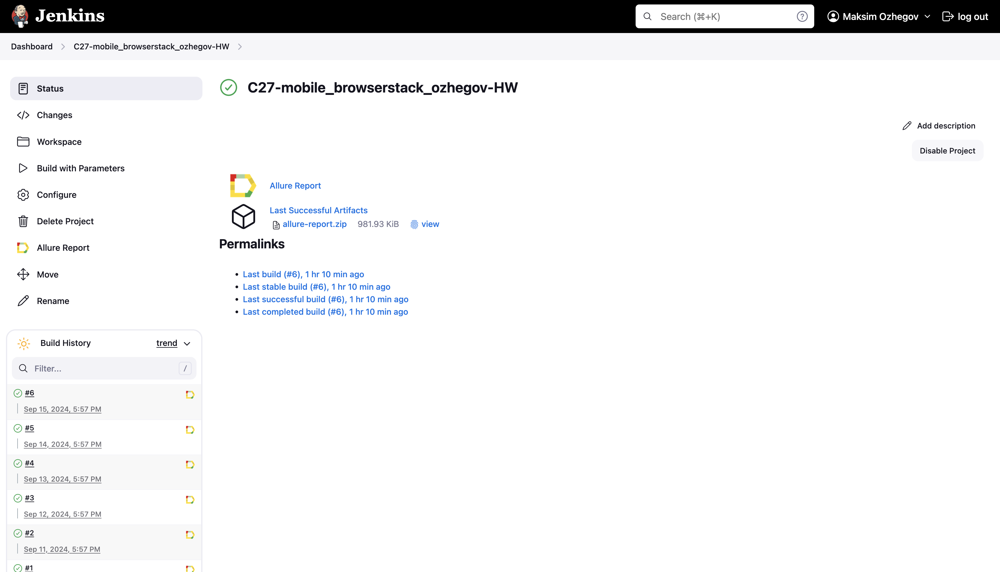

# Мобильная автоматизация с использованием Browserstack

## <a>**Задача:**</a>

1. Разработать автотесты на поиск статей в Android-приложении [Wikipedia](https://github.com/wikimedia/apps-android-wikipedia):
- При написании тестов использовать связку **Selenide** + **Appium**
- Удаленный запуск осуществлять через **Browserstack**
2. С помощью бибилиотеки **Owner**:
- Вынести данные Browserstack (логин, пароль, урл и т.д.) в конфигурационный файл
- Сделать два вида конфигурационных файлов для запуска на разных Android устройствах
- Сделать возможность с помощью одной системной переменной переключать запуск с одного устройства на другое
3.  Сделать сборку в **Jenkins**

## <a>**Реализация:**</a>

### Команды запуска
- Команда для запуска тестов через консоль на устройстве Samsung:
```bash  
gradle clean test -Ddevice_name=samsung
```
- Команда для запуска тестов через консоль на устройстве Pixel:
```bash  
gradle clean test -Ddevice_name=pixel
```
- Удалённый запуск через Jenkins:
```bash
clean test -Ddevice_name=${DEVICE}
```
## </a><a name="Сборка в Jenkins"></a>Сборка в [Jenkins](https://jenkins.autotests.cloud/job/C27-mobile_browserstack_ozhegov-HW)</a>

<p align="center">  
  
</p>
